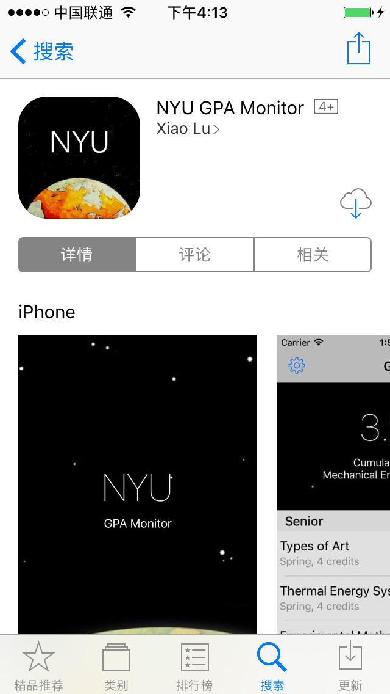
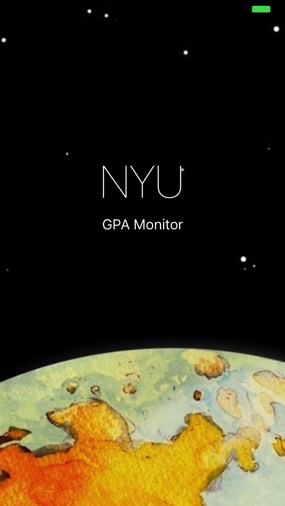
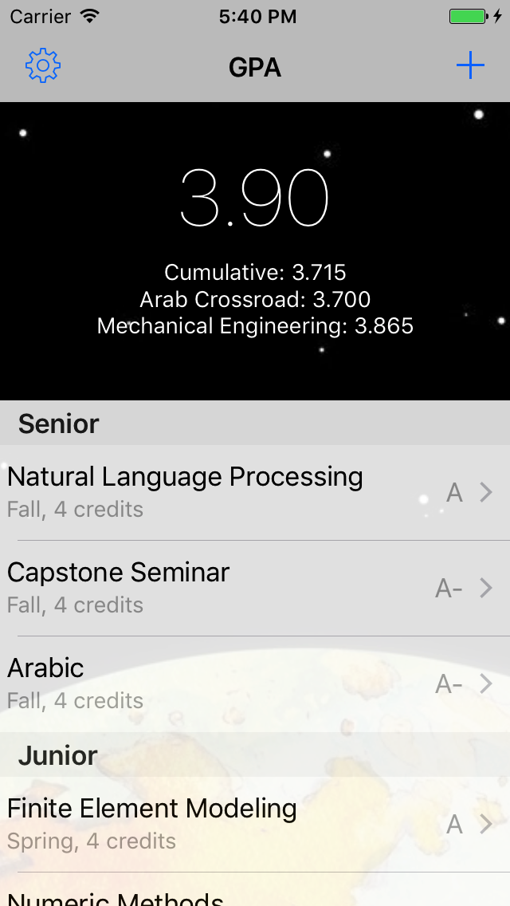
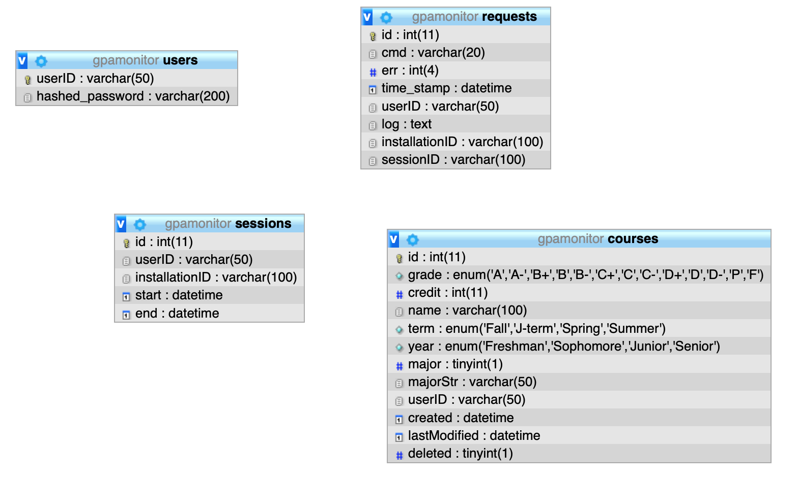
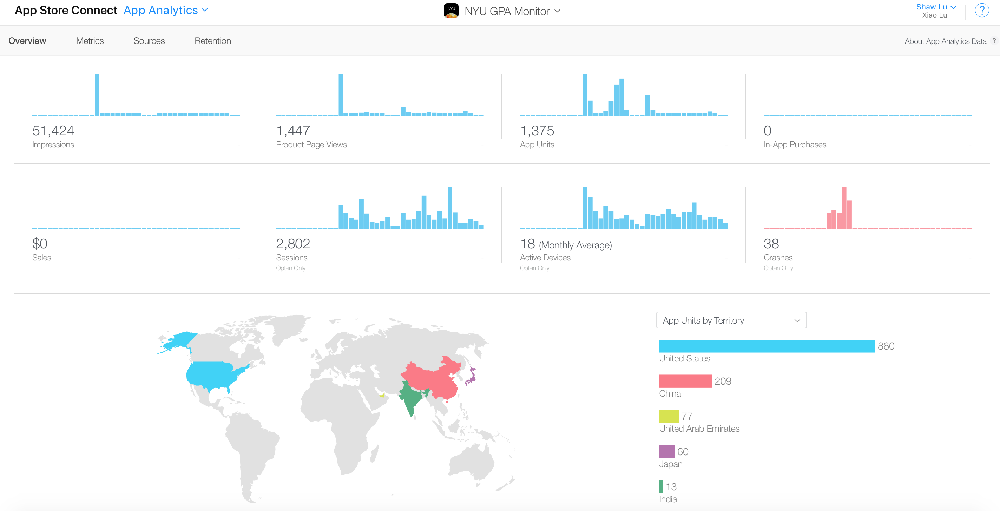

## NYU GPA Monitor
This is light-weight iOS app helping New York University Abu Dbabi students calculating their GPAs, including official GPA, cumulative GPA, departmental GPA, yearly GPA. 

Official GPA is of great interests for NYU Abu Dhabi students, because the official GPA is not officially available until graduation, but routinely needed in internship applications, grad school applications, job application. This app offers a quick, reliable way to calculate official GPA.

    
  
  

The full package contains the [server](server/) code (PHP) and [iOS](iOS/) code (Objective-C). The PHP server is connected to MySQL database. The schema of the database can be found [here](server/gpamonitor.sql). Set up databaase connection [here](server/includes/conf_db.php). The app can be run without the server, but users may not register account and sync their course history with the server.

    

The app had been downloaded 1375 times, out of 1447 product page views (95% of product page views resulted in download). Considering NYU Abu Dhabi has a small student body of 200 per class. This app has achieved high coverage on campus. __Unfortunately, this app is no longer in the app store, after my Appple Developer Program expired.__ I am looking for interested party to transfer the app ownership and source code.

    

